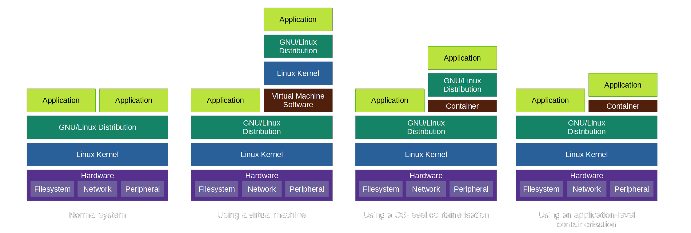

容器技术简介
=============================================

- [用rust写个容器系列教程](./README.md)

本系列教程的目标：
 - 容器的工作原理
 - 用纯rust创建一个容器并管理它。

本教程基于另一套非常棒的系列教程[500行写个linux容器](https://blog.lizzie.io/linux-containers-in-500-loc.html)，但是是用rust语言。

理解我们如何构建容器之前， 首先应该知道什么是容器，为什么需要容器。下面我们将通过常用示例来说明。

## 什么是容器

### 简介

容器其实就是一个隔离的执行环境，提供了要执行的软件和底层操作系统之间的抽象层。可以看做是一个软件虚拟化的进程。
总体来说就是我们告诉容器“执行这个程序”，容器管理器就会启动一个沙箱(对程序来说就是类似一个操作系统)并且执行指定的程序。

### 用途
容器化技术目前被广泛使用， 因为它提供极大的灵活性、高可用性和独立性。及时一个服务挂了甚至被入侵了，也不会影响到其他服务。

### 可移植性
容器是一种解决移植性问题的非常好的解决方案。软件不需要安装到操作系统上， 只需要启动容器，然后在容器中运行软件即可。

正如[docker文档](https://www.docker.com/resources/what-container)中说的：
> 容器是一个包含软件代码和依赖项的标准单元(standard unit)，所以可以快速可靠的移动到任何电脑。一个docker镜像是一个轻量的、独立的、可执行的软件包，它包含app需要的任何东西:代码、运行时、系统工具、系统类库还有设置。

这样就省去了配置环境的麻烦，可以在不同的电脑或服务器建无缝切换。

### 隔离性
每一个容器化的应用都有一个隔离的运行环境，这点类似虚拟机。和虚拟机的不同[docker文档](https://www.docker.com/resources/what-container)也有说明：
> docker和虚拟机都有环境隔离和资源分配的功能，但是实现方式不同，docker直接虚拟操作系统而不是硬件。

所以我们可以在容器内运行任何命令或程序而不会影响到系统。当然这只是理论上的， 容器安全有很多因素。我们还是应该避免容器逃逸(container evasion)(虚拟机同样存在逃逸问题)，更多可以看这篇很好的文章[理解docker容器逃逸](https://blog.trailofbits.com/2019/07/19/understanding-docker-container-escapes/)

### 容器化种类

上图的说法是不严谨的，CPU/SoC硬件包括软件栈都有廉价的虚拟方式，这里就不细说了。但可以直观的表现出来当下实现可移植性和隔离性的方法。

从图中可以看出不同的虚拟类型。 如： lxc是[系统级虚拟](https://en.wikipedia.org/wiki/OS-level_virtualization)而docker是应用级虚拟。

### 容器就是被隔离软件

什么是软件隔离？ 就是软件可以在系统中运行，但不会对系统变更系统的任何东西。所以被隔离的软件应该禁止访问没有被允许的文件、使用系统的特性、更改系统的配置或影响系统的性能。

实现这些有多种方法， 常用的是围绕软件进行限制，使软件在系统中是个瞎子。

所以，容器是含有一系列安全措施的软件隔离环境。
